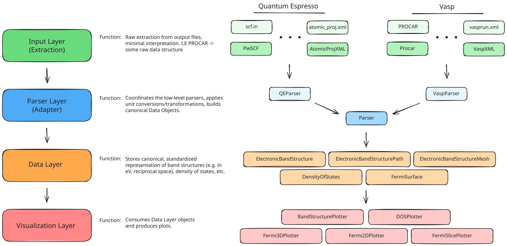

# Architecture Overview
PyProcar is a Python toolkit for analysing and visualising first-principles
electronic-structure calculations (primarily VASP, QE). The codebase follows a
layered dataflow architecture that keeps raw extraction, canonical data objects,
and visualisation clearly separated. Core domain objects—such as
`ElectronicBandStructure`, `DensityOfStates`, `BandStructure2D`, and
`FermiSurface`—share a common `PointSet`-based interface so that downstream
layers can reason about them uniformly.

## 1. Project Structure
The repository is organised around the architecture layers and key workflows.

```
[Project Root]/
├── pyprocar/                 # Library source
│   ├── core/                 # Canonical data-layer classes & utilities
│   │   ├── bandstructure.py
│   │   ├── dos.py
│   │   ├── bandstructure2d.py
│   │   ├── fermi_surface.py
│   │   ├── kmesh.py
│   │   ├── structure.py
│   │   ├── atomic_orbital_index.py
│   │   └── property_store.py
│   ├── io/                   # Extraction + parser layer (code-specific adapters)
│   ├── plotter/              # Visualisation layer consuming data objects
│   ├── utils/                # Shared math, formatting, and helper utilities
│   └── __init__.py
├── examples/                 # Usage examples and reference notebooks/scripts
├── tests/                    # Unit and regression tests (pytest)
├── docs/                     # Sphinx documentation (see density_of_states_overview.md)
├── scripts/                  # Maintenance utilities (doc generation, helpers)
├── env.yml / pixi.lock       # Environment definitions (pixi-based workflows)
├── pyproject.toml / setup.py # Packaging metadata
├── ARCHITECTURE.md           # This document
└── README.md                 # Top-level overview and quickstart
```

## 2. High-Level System Diagram
Data moves from raw calculation output toward visualisation in four layers:

```
[Simulation Outputs]
      │  (e.g., PROCAR, vasprun.xml, QE files)
      ▼
[Input / Extraction Layer]
      │  (pyprocar.io.* extractors)
      ▼
[Parser Layer]
      │  (pyprocar.io.Parser + code-specific adapters)
      ▼
[Data Layer]
      │  (pyprocar.core.* PointSet-based objects)
      ▼
[Visualisation Layer]
         (pyprocar.plotter.* plotters, notebooks, CLI)
```

Each boundary is unidirectional: upstream layers never call downstream code.
Transformations and analytics live in the data layer, while visual elements stay
within the plotter modules or external user scripts.

## 3. Core Components

### 3.1 Input Layer (Extraction)
- **Location**: `pyprocar/io/extractors` and related modules.
- **Responsibility**: Read raw simulator files (VASPPROCAR, vasprun.xml, QE
  outputs) with minimal interpretation; return Python dicts, NumPy arrays, or
  other plain structures.
- **Guidance**: No unit conversion, no canonical objects, no plotting. Keep it
  stateless and file-format aware only.

### 3.2 Parser Layer (Adapter)
- **Location**: `pyprocar/io/parser.py` and code-specific subclasses.
- **Responsibility**: Combine extractor outputs, perform unit conversions, and
  produce canonical data-layer instances. Entry points like
  `Parser(code="vasp", dirpath=...)` hide format details from users.
- **Guidance**: Deterministic processing; never touch visualisation or disk
  output beyond optional caching (`DensityOfStates.save`, etc.).

### 3.3 Data Layer (Canonical Domain Objects)
- **Location**: `pyprocar/core`.
- **Responsibility**: Represent band structures, DOS, Fermi surfaces, Brillouin
  zones, and related physics concepts using consistent APIs. These objects are
  the contract between parsers and all downstream consumers.
- **Guidance**: Pure data + analysis helpers; keep I/O and plotting out of this
  layer. Reuse the `PointSet`/`Property` pattern where applicable.

### 3.4 Visualisation Layer
- **Location**: `pyprocar/plotter`.
- **Responsibility**: Accept canonical objects and render Matplotlib/PyVista
  plots (e.g., `DOSPlotter`, `BandStructurePlotter`, `Fermi3DPlotter`).
- **Guidance**: Assume inputs are fully prepared; never read simulation files or
  recompute physical quantities already available on the data objects.

### 3.5 Utilities & Tooling
- **Location**: `pyprocar/utils`, `scripts/`, `examples/`.
- **Responsibility**: Math helpers, CLI tooling, demonstration scripts. These
  modules should depend on data-layer contracts rather than raw extractors when
  possible.

## 4. Domain Data Objects and Interfaces
Core data types live under `pyprocar.core` and share a common design anchored in
`PointSet` and `Property`:

- **PointSet (`property_store.py`)**  
  Manages a 1D grid of sample points plus a registry of aligned `Property`
  instances. Provides gradient helpers and ensures dimensional consistency.

- **Property (`property_store.py`)**  
  Wraps NumPy arrays with metadata (labels, units, bounds) and optional
  precomputed gradients. Maintains a weak reference back to its owning
  `PointSet`.

- **DensityOfStates (`dos.py`)**  
  Implements the reference interface (see
  `docs/source/density_of_states_overview.md`). Key characteristics: constructed
  via factories (`DensityOfStates.from_code`), exposes energy-aligned properties
  (`total`, `projected`, computed properties), offers transformations like
  `interpolate` and `shift_by_fermi`, and returns new `Property` objects for
  analytics.

- **ElectronicBandStructure (`bandstructure.py`)**  
  Mirrors the DOS interface for k-path band energies. Stores k-point paths as
  the underlying `PointSet`, exposes band-energy `Property` objects, and offers
  selection/normalisation helpers scoped to bands, spins, and projections.

- **BandStructure2D (`bandstructure2d.py`)**  
  Extends the pattern to two-dimensional k-meshes. Uses structured grids to
  provide energy maps and derived scalar fields (e.g., curvature, gradients)
  while keeping metadata and gradient facilities aligned with `PointSet`.

- **FermiSurface (`fermi_surface.py`)**  
  Wraps isosurface representations of constant-energy manifolds. Exposes
  geometry and projection properties via the same property-store mechanism so
  meshing, interpolation, and projections can be handled uniformly.

- **Structure (`structure.py`)**  
  Canonical representation of atomic positions, species, and lattice vectors.
  Consumed by other data objects for context (e.g., mapping projections to
  atoms).

- **KMesh (`kmesh.py`)**  
  Describes regular reciprocal-space grids; provides utilities for mapping
  between reciprocal coordinates and projected properties.

- **AtomicOrbitalIndex (`atomic_orbital_index.py`)**  
  Supplies indexers and label builders used by DOS/band projection routines.

Each of the major physics objects (`ElectronicBandStructure`, and `DensityOfStates`) is designed to adopt the
same `PointSet` foundation with metadata-rich `Property` outputs. Align new
implementations to this contract: minimal constructors, factory-based creation,
and transformation methods that prefer returning new instances over mutating
state.

## 5. Data Stores
PyProcar does not rely on external databases. Persistence happens through:

- **On-disk cache files** (e.g., `dos.pkl`): optional pickled snapshots of data
  objects written/read by parser helpers.
- **User-provided calculation directories**: raw simulation outputs remain in
  their original formats; PyProcar reads but does not modify them.

## 6. External Integrations / File Formats
- **Simulation formats**: VASP (`PROCAR`, `vasprun.xml`, `DOSCAR`),
  Quantum ESPRESSO (`projwfc`, `pwscf` outputs), and other first-principles
  codes supported by extractors.
- **Plotting stacks**: Matplotlib, PyVista, Plotly (depending on plotter module)
  for rendering results.
- **Optional**: SciPy for interpolation and numerical integration.

## 7. Deployment & Distribution
- **Package**: Distributed as a Python library (`pyproject.toml`, `setup.py`).
- **Environment management**: `pixi` environments (`pixi install -e tests`,
  `pixi run -e tests ...`) and `env.yml` for conda-style setups.
- **CI/CD**: Refer to GitHub Actions or project-specific workflows if present.
  (Update this section if continuous integration pipelines are added.)

## 8. Development & Testing Environment
- **Local setup**: Follow `README.md` or `AGENTS.md` for environment creation
  (`pixi install -e tests`, `pixi shell -e tests`).
- **Testing**: Pytest-based suite under `tests/`. Run targeted tests as needed
  (e.g., `pixi run -e tests pytest tests/pyprocar/core/test_dos.py`).
- **Code quality**: Formatting and linting rely on standard Python tooling
  (Black, isort, mypy) as configured in `pyproject.toml`. Utilities in
  `scripts/` may assist with documentation or dataset generation.

## 9. Future Considerations / Roadmap
- Continue harmonising data-layer classes around the `PointSet`/`Property`
  contract for predictable downstream usage.
- Expand parser coverage for additional simulation packages while keeping
  extractor/parser separation intact.
- Improve caching and lazy-loading strategies for large datasets (band surfaces,
  dense projections).
- Document plotting extension points so that custom visualisations can hook into
  the same canonical objects.

## 10. Project Identification
- **Project Name**: PyProcar
- **Repository URL**: https://github.com/romerogroup/pyprocar (update if forked)
- **Primary Contact/Team**: Romero Group / maintainers listed in `AUTHORS.rst`
- **Date of Last Update**: 2025-02-14

## 11. Glossary / Acronyms
- **DOS**: Density of States.
- **BandStructure2D**: Two-dimensional sampling of band energies across a k-mesh.
- **Fermi Surface**: Constant-energy surface at the Fermi level.
- **PointSet**: Core alignment container for sample points and properties.
- **Property**: Metadata-rich wrapper around NumPy arrays aligned with a
  `PointSet`.
- **Parser**: Adapter that transforms raw extractor outputs into canonical data
  objects.
