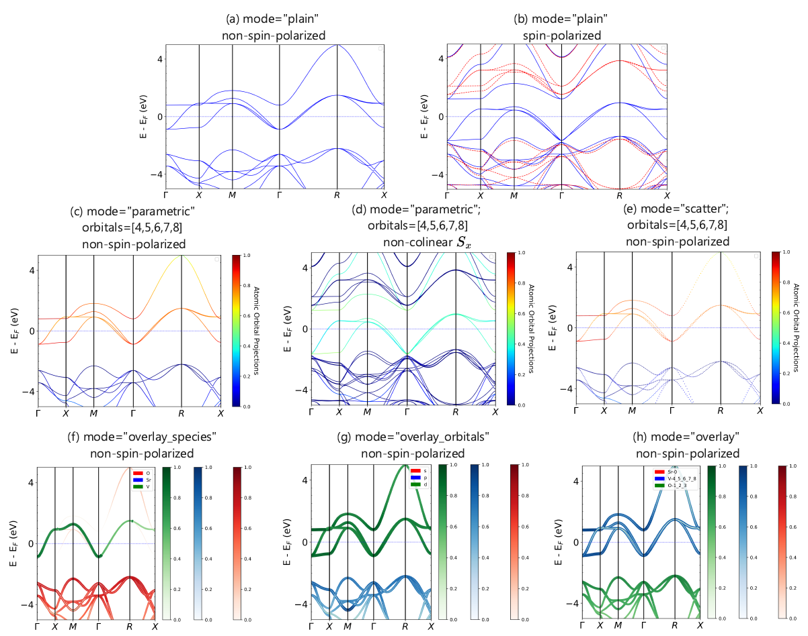
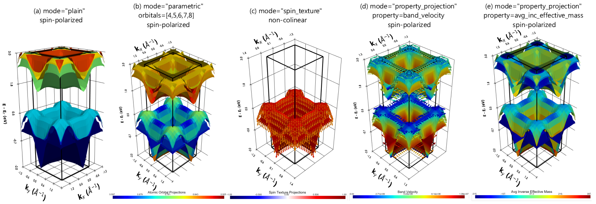
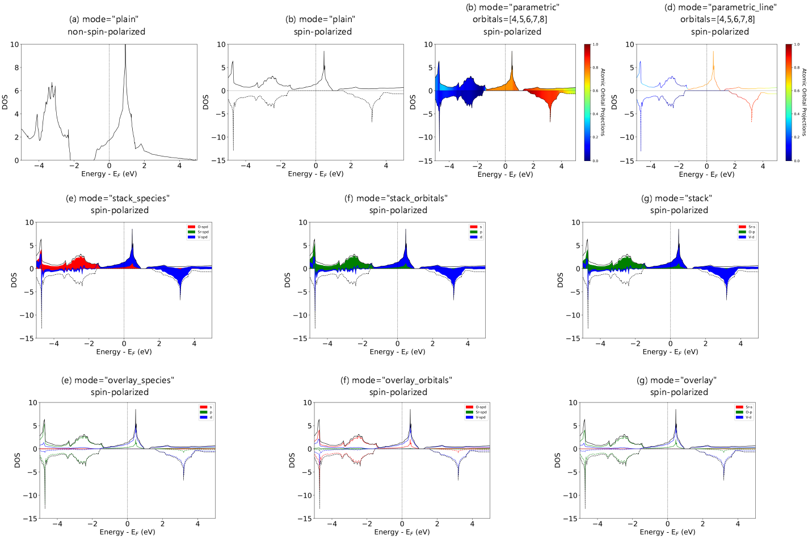
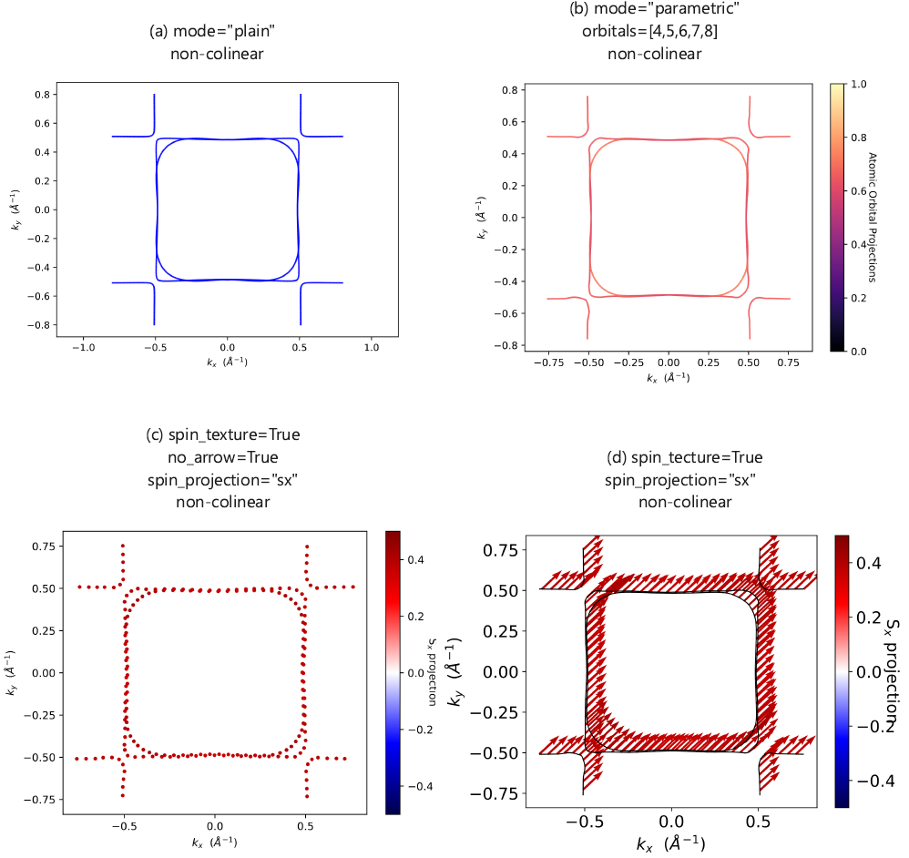
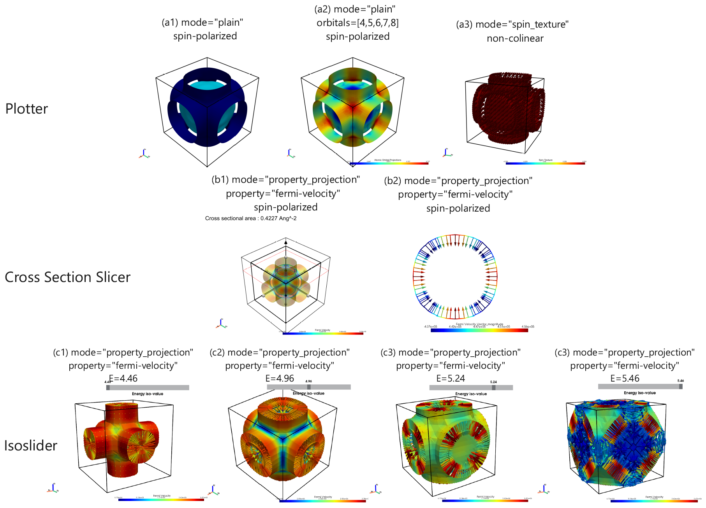

[Documentation][docs] | [PyPI][pypi] | [GitHub][github]

PyProcar
--------

PyProcar is a robust, open-source Python library used for pre- and post-processing of the electronic structure data coming from DFT calculations. PyProcar provides a set of functions that manage data obtained from the PROCAR format. Basically, the PROCAR format is a projection of the Kohn-Sham states over atomic orbitals. That projection is performed to every k-point in the considered mesh, every energy band and every atom. PyProcar is capable of performing a multitude of tasks including plotting plain and spin/atom/orbital projected band structures and Fermi surfaces- both in 2D and 3D, Fermi velocity plots, unfolding bands of a super  cell, comparing band structures from multiple DFT calculations, plotting partial density of states and generating a k-path for a given crystal structure.

Currently supports:

1. VASP
2. Elk (Stll in development)
3. Quantum Espresso
4. Abinit (DOS Stll in development)
5. Lobster (Stll in development)

Installation
============

with pip:

	pip install pyprocar

with conda:

    conda install -c conda-forge pyprocar

### Usage

Typical use is as follows

    import pyprocar
    pyprocar.bandsplot(code='vasp',mode='plain', dirname='bands')

Previously, bandsplot would accept the OUTCAR and PROCAR file paths as inputs,
in v6.0.0 we moved to specifying the directory where the bands calculation took place.

Refer to the documentation for further details.

Stand-alone mode:

    procar.py -h

will bring a help menu.

Notice
===========
- **New Release** We recently updated to a new version 'v6.2.1'.
- **Support for Previous Versions**: For users who prefer to continue with an older version, we have conveniently archived the previous releases on GitHub, and provided a link to the corresponding documentation.

Showcase: What PyProcar Can Do
=================================
PyProcar is capable of performing a multitude of tasks including plotting plain and spin/atom/orbital projected band structures and Fermi surfaces- both in 2D and 3D, Fermi velocity plots, unfolding bands of a super cell, comparing band structures from multiple DFT calculations, plotting partial density of states and generating a k-path for a given crystal structure.

### Crystal Field Splitting in SrVO₃

<strong>What is being plotted:</strong> Orbital-projected band structure showing crystal field splitting of d-orbitals in SrVO₃, illustrating how PyProcar can decompose electronic bands by orbital character to reveal crystal field effects in transition metal compounds.

### Dirac Point Identification in Graphene

<strong>What is being plotted:</strong> Band structure of Graphene highlighting the Dirac points where conduction and valence bands meet, showcasing PyProcar's capability to identify and analyze topological features and linear dispersion relations in 2D materials.

### Fermi Surface Analysis - Gold Van Alphen Frequencies

<strong>What is being plotted:</strong> Fermi surface cross-sections and Van Alphen oscillation frequencies for Gold, demonstrating PyProcar's ability to analyze the topology of Fermi surfaces and calculate quantum oscillation properties in metals.

### Spin-Orbit Coupling and Rashba Effect in BiSb Monolayer

<strong>What is being plotted:</strong> Spin-resolved band structure of BiSb monolayer showing the Rashba spin-orbit coupling effect, demonstrating PyProcar's ability to visualize spin-polarized electronic structures and analyze spin-orbit interactions in topological materials.

### Band Structure Visualization

<strong>What is being plotted:</strong> Electronic band structure showing energy bands along high-symmetry k-points, demonstrating PyProcar's capability to generate clean, publication-ready band structure plots with customizable styling and projection options.

### 2D Band Structure Analysis

<strong>What is being plotted:</strong> Two-dimensional band structure visualization showing energy dispersion across the entire Brillouin zone, highlighting PyProcar's ability to create comprehensive 2D band maps for analyzing electronic properties and band topology.

### Density of States Analysis

<strong>What is being plotted:</strong> Density of states (DOS) with orbital and species projections, showcasing PyProcar's ability to decompose the total DOS into atomic and orbital contributions for detailed electronic structure analysis.

### 2D Fermi Surface Mapping

<strong>What is being plotted:</strong> Two-dimensional Fermi surface cross-sections showing the topology of the Fermi level, demonstrating PyProcar's capability to visualize Fermi surfaces in 2D planes with high resolution and customizable projections.

### 3D Fermi Surface Visualization

<strong>What is being plotted:</strong> Three-dimensional Fermi surface rendering showing the complete topology of electronic states at the Fermi level, highlighting PyProcar's advanced 3D visualization capabilities for comprehensive Fermi surface analysis and interactive exploration.

Documentation
-------------

For versions 6.1.0 and above, the documentation is found here:
[docs]

The prior documentation is found here:
https://romerogroup.github.io/pyprocar5.6.6/

Developers
------------
Francisco Muñoz  
Aldo Romero  
Sobhit Singh  
Uthpala Herath  
Pedram Tavadze  
Eric Bousquet  
Xu He  
Reese Boucher  
Logan Lang  
Freddy Farah  

How to cite
-----------
If you have used PyProcar in your work, please cite:

- U. Herath, P. Tavadze, X. He, E. Bousquet, S. Singh, F. Muñoz, and A. H. Romero, PyProcar: A Python library for electronic structure pre/post-processing, Computer Physics Communications 251, 107080 (2020). DOI: <https://doi.org/10.1016/j.cpc.2019.107080>

- L. Lang, P. Tavadze, A. Tellez, E. Bousquet, H. Xu, F. Muñoz, N. Vasquez, U. Herath, and A. H. Romero, Expanding PyProcar for new features, maintainability, and reliability, Computer Physics Communications 297, 109063 (2024). DOI: <https://doi.org/10.1016/j.cpc.2023.109063>

Thank you.

BibTex:

    @article{HERATH2020107080,
    title = "PyProcar: A Python library for electronic structure pre/post-processing",
    journal = "Computer Physics Communications",
    volume = "251",
    pages = "107080",
    year = "2020",
    issn = "0010-4655",
    doi = "https://doi.org/10.1016/j.cpc.2019.107080",
    url = "http://www.sciencedirect.com/science/article/pii/S0010465519303935",
    author = "Uthpala Herath and Pedram Tavadze and Xu He and Eric Bousquet and Sobhit Singh and Francisco Muñoz and Aldo H. Romero",
    keywords = "DFT, Bandstructure, Electronic properties, Fermi-surface, Spin texture, Python, Condensed matter",
    }

    @article{LANG2024109063,
    title = {Expanding PyProcar for new features, maintainability, and reliability},
    journal = {Computer Physics Communications},
    volume = {297},
    pages = {109063},
    year = {2024},
    issn = {0010-4655},
    doi = {https://doi.org/10.1016/j.cpc.2023.109063},
    url = {https://www.sciencedirect.com/science/article/pii/S0010465523004083},
    author = {Logan Lang and Pedram Tavadze and Andres Tellez and Eric Bousquet and He Xu and Francisco Muñoz and Nicolas Vasquez and Uthpala Herath and Aldo H. Romero},
    keywords = {Electronic structure, DFT, Post-processing},
    }

Mailing list
-------------
Please post your questions on our forum.

https://groups.google.com/d/forum/pyprocar

Changelog
--------------

For the old changelog, see [CHANGELOG.md](CHANGELOG.md)

---

[docs]: https://pyprocar.readthedocs.io/en/latest/
[pypi]: https://pypi.org/project/pyprocar/
[github]: https://github.com/romerogroup/pyprocar
[contributing]: https://github.com/romerogroup/pyprocar/blob/main/CONTRIBUTING.md
[license]: https://github.com/romerogroup/pyprocar/blob/main/LICENSE

[pypi-version]: https://badge.fury.io/py/pyprocar
[conda-forge-version]: https://img.shields.io/conda/v/conda-forge/pyprocar.svg?label=conda-forge&colorB=027FD5
[build-status]: https://travis-ci.org/romerogroup/pyprocar
[hitcount]: http://hits.dwyl.com/uthpalaherath/romerogroup/pyprocar
[pypi-downloads]: https://img.shields.io/pypi/dm/pyprocar

