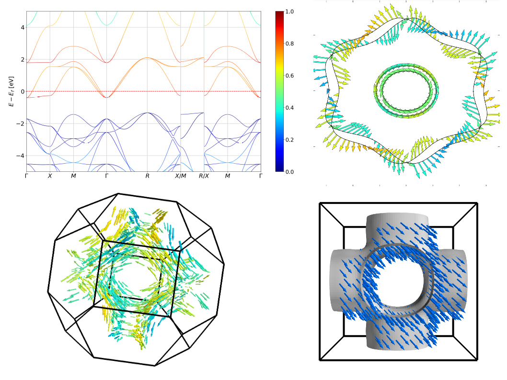

PyProcar
===========

PyProcar is a robust, open-source Python library used for pre- and post-processing of the electronic structure data coming from DFT calculations. PyProcar provides a set of functions that manage data obtained from the PROCAR format. Basically, the PROCAR format is a projection of the Kohn-Sham states over atomic orbitals. That projection is performed to every k-point in the considered mesh, every energy band and every atom. PyProcar is capable of performing a multitude of tasks including plotting plain and spin/atom/orbital projected band structures and Fermi surfaces- both in 2D and 3D, Fermi velocity plots, unfolding bands of a super  cell, comparing band structures from multiple DFT calculations, plotting partial density of states and generating a k-path for a given crystal structure.

Currently supports:

1. VASP
2. Elk
3. Quantum Espresso
4. Abinit
5. Lobster

Documentation
-------------

https://romerogroup.github.io/pyprocar/

Developers
------------
Francisco Muñoz  
Aldo Romero  
Sobhit Singh  
Uthpala Herath  
Pedram Tavadze  
Eric Bousquet  
Xu He  
Reese Boucher  
Logan Lang  
Freddy Farah  

How to cite
-----------
If you have used PyProcar in your work, please cite:

[Uthpala Herath, Pedram Tavadze, Xu He, Eric Bousquet, Sobhit Singh, Francisco Muñoz, and Aldo H. Romero. "PyProcar: A Python library for electronic structure pre/post-processing". Computer Physics Communications 251 (2020): 107080.](https://www.sciencedirect.com/science/article/pii/S0010465519303935)

Thank you.

BibTex:

    @article{HERATH2020107080,
    title = "PyProcar: A Python library for electronic structure pre/post-processing",
    journal = "Computer Physics Communications",
    volume = "251",
    pages = "107080",
    year = "2020",
    issn = "0010-4655",
    doi = "https://doi.org/10.1016/j.cpc.2019.107080",
    url = "http://www.sciencedirect.com/science/article/pii/S0010465519303935",
    author = "Uthpala Herath and Pedram Tavadze and Xu He and Eric Bousquet and Sobhit Singh and Francisco Muñoz and Aldo H. Romero",
    keywords = "DFT, Bandstructure, Electronic properties, Fermi-surface, Spin texture, Python, Condensed matter",
    }

Mailing list
-------------
Please post your questions on our forum.

https://groups.google.com/d/forum/pyprocar

Dependencies
------------
matplotlib  
numpy  
scipy  
seekpath  
ase  
scikit-image  
pychemia  
pyvista  

Installation
------------

with pip:

	pip install pyprocar

with conda:

    conda install -c conda-forge pyprocar

Usage
-----
Typical use is as follows

    import pyprocar
    pyprocar.bandsplot('PROCAR',outcar='OUTCAR',mode='plain',code='vasp')

Refer to the documentation for further details.

Stand-alone mode:

    procar.py -h

will bring a help menu.

Changelog
--------------

v5.6.4 May 6th, 2021 -- Updates to Fermi surface plotter.  
v5.6.3 Mar 5th, 2021 -- QE and elk bug fixes.  
v5.6.2 Jan 11th, 2021 -- Updates and bugfixes to fermi surface and dos plotter.  
v5.6.1 Dec 7th, 2020 -- Fixed bug in PyProcar.cat() for merging parallel Abinit files for spin polarized calculations. Converted units Ha to eV.  
v5.6.0 Nov 30th, 2020 -- Repairs PROCAR file by default. Set flag repair=False to disable.  
v5.5.8 Nov 24th, 2020 -- Updates to parametric band structure plotting. Ability to change linewidths with ``linewidth`` flag.  
v5.4.4 Oct 23rd, 2020 -- Updates to DOS plotting, Fermi3D and bxsf parser and other bugfixes.  
v5.5.2 July 27th, 2020 -- Updated spin colinear calculations for Quantum Espresso and Lobster codes.  
v5.4.3 July 25th, 2020 -- Bug fixes in stand-alone version and updates to bandgap calculation.  
v5.4.0 Jun 17th, 2020 -- Improved 3D Fermi Surface plotter, added support for Quantum Espresso, conda support.   
v5.3.3 May 22nd, 2020 -- Added DOS plotting feature.  
v5.2.1 May 11th, 2020 -- Bugfixes in pyprocar.cat and improving comparison method.  
v5.2.0 Apr 21st, 2020 -- Added spin colinear plotting feature for Elk calculations and a method to plot spin up and spin down plots separately without the need to filter the PROCAR file.  
v5.1.9 Apr 14th, 2020 -- Added feature to filter colinear spins in pyprocar.filter().  
v5.1.8 Mar 27th, 2020 -- Fix iband reading error due to vasp incorrectly writting iband>999.  
v5.1.5 Mar 8th, 2020 -- Fixed summation issues in ElkParser.  
v5.1.4 Mar 7th, 2020 -- Added new class for parsing Abinit data. 
v5.1.3 Mar 5th, 2020 -- Fixed Abinit PROCAR formatting issues in PyProcar cat function. 
v5.1.1 Mar 5th, 2020 -- Removed bandscompare() due to redundancy with exportplt. 
v5.1.0 Mar 4th, 2020 -- Elk implementation. 
v5.0.1 Mar 2nd, 2020 -- Added orbital header array for newer version of VASP. 
v5.0.0 Mar 1st, 2020 -- Added discontinuous band-plotting feature and other improvements.  
v4.1.4 Feb 28th, 2020 -- Added option to convert k-points between reduced and cartesian when OUTCAR is supplied.  
v4.1.3 Feb 27th, 2020 -- Renormalize alpha values in band unfolder for values > 1.  
v4.1.2 Feb 24th, 2020 -- Bug fixes in band unfolder.  
v4.1.1 Feb 12th, 2020 -- Added feature to compare two parametric plots with colormaps in bandscompare. 
v4.1.0 Jan 10th, 2020 -- Added feature to export plots as matplotlib.pyplot objects for further processing through matplotlib options.  
v4.0.4 Dec 6th, 2019 -- Added command-line compatibility to standalone version and better Latex rendering. 
v4.0.1 Nov 17th, 2019 -- Added feature to filter k-points.  
v4.0.0 Nov 6th, 2019 -- Various bug fixes. Release of standalone version. Updated documentation. 
v3.9.2 Oct 4, 2019 -- Fixed bug in 2D Kmesh generator.  
v3.9.1 Sep 15, 2019 -- Fixed unfold spin polarized eigenvalue bug and spin up/down band energy error in unfolding. 
v3.9.0 Sep 12, 2019 -- Fixed spin polarized band unfolding.   
v3.8.9 Sep 9, 2019 -- Added bbox_inches='tight' for savefig. 
v3.8.8 Jul 24, 2019 -- Fixed ambiguity in spin flag.  
v3.8.7 Jul 21, 2019 -- Fixed bug in K-mesh generator.  
v3.8.6 Jun 26, 2019 -- Bug fixes in band unfolding Fermi shift energy and band structure labels for Fermi shifts.  
v3.8.5 Jun 13, 2019 -- Bug fixes in Fermi surface plotting.  
v3.8.4 Jun 11, 2019 -- Fixed parsing old PROCAR format.  
v3.8.3 Jun 05, 2019 -- Updated parsing for PROCAR with phase.  
v3.8.2 Jun 05, 2019 -- Updated docs.  
v3.8.1 Jun 05, 2019 -- Updated reading from gzip for binary data. Increased parsing speed when phase factors are present.  
v3.71 Jun 05, 2019 -- More bug fixes.  
v3.7 Jun 04, 2019 -- Bug fixes for Fermi surface. 
v3.6 Jun 04, 2019 -- Added 3D Fermi surface utility. 
v3.5 May 22, 2019 -- added automatic high symmetry point labeling from KPOINTS file. 
v3.4 May 21, 2019 -- Bug fixes for plotting and added capability to plot meta-GGA.  
v3.3 Mar 19, 2019 -- Added band unfolder.  
v3.2 Nov 26, 2018 -- Moved project to romerogroup. 
v3.1 Sep 19, 2018 -- Minor bug fixes.  
v3.0 Sep 17, 2018 -- Added method to compare two PROCARs. Moved to Python3.  
v2.9 Jul 29,2018 -- Created PyProcar Mailing list. 
v2.8 May 23,2018 -- Fixed procar.cat() 
v2.7 May 18,2018 -- Fixed out-of-bounds error in k path generator. 
v2.6 May 18,2018 -- Fixed more issues with fermi2D 
v2.5 May 18.2018 -- Fixed issue with Vector 
v2.4 May 18,2018 -- Fixed minor issues with fermi2D and procarsymmetry 
v2.3 May 17,2018 -- Added k path generator. 
v2.2 May 14,2018 -- Updated documentation. 
v2.1 Apr 03,2018 -- Fixed issue with input arguments when using OUTCAR as an input  
v2.0 Mar 21,2018 -- Created PyProcar package version with added support to Abinit.  
v0.1.0, June 10, 2013 -- Initial release. 
