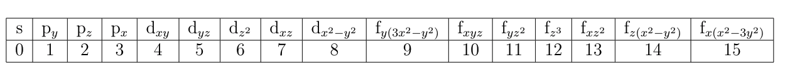

.. _bands:

Band structure
===================

PyProcar goes beyond the conventional plain band structure to plot the projected bands that carry even more information. The projected bands are color coded in an informative manner to portray fine details.

=======================
1. Plain band structure
=======================

This is the most basic type of band structure. No projection information is contained here. In order to use the plain mode one sets ``mode='plain'``. ``elimit`` sets the energy window limits. ``outcar`` specifies the **OUTCAR** file. For Abinit calculations, ``abinit_output`` is used instead. ``color`` lets the user use any color available in the matplotlib package. If an output file is not present one can set ``fermi`` manually. One may save the plot using the ``savefig`` tag, for example, ``savefig='figure.png'`` with a desired image file format. This applies to all other band structure plotting functions in PyProcar as well. For Elk, setting file='PROCAR' and outcar='OUTCAR' is not necessary. As long as the path to **elk.in** is defined or PyProcar is executed in the directory of calculation, PyProcar will work of the files needed for the bandsplot.

Usage::

	pyprocar.bandsplot(code='vasp',dirname='bands',elimit=[-2,2],mode='plain',color='blue')

PyProcar is capable of labeling the :math:`k`-path names automatically, however, the user can manually input them as desired.

One may manually label the :math:`k`-path as well. ``knames`` and ``kticks`` corresponds to the labels and the number of grid points between the high symmetry points in the :math:`k`-path used for the band structure calculation. 

Usage::

	pyprocar.bandsplot(code='vasp',dirname='bands',elimit=[-2,2],mode='plain',color='blue',kticks=[0,39,79,119,159],knames=['G','X','M','G','R'])

==================
2. Spin projection
==================

For collinear spin polarized and non-collinear spin calculations of DFT codes, PyProcar is able to plot the bands considering spin density (magnitude), spin magnetization and spin channels separately.

For non-collinear spin calculations, ``spins=[0]`` plots the spin density (magnitude) and ``spins=[1,2,3]`` 
corresponds to spins oriented in :math:`S_x`, :math:`S_y` and :math:`S_z` directions respectively. Setting ``spin='st'`` 
plots the spin texture perpendicular in the plane (:math:`k_x`, :math:`k_y`) to each (:math:`k_x`,i :math:`k_y`) vector. 
This is useful for Rashba-like states in surfaces. For parametric plots such as spin, atom and orbitals, 
the user should set ``mode=`parametric'``. ``cmap`` refers to the matplotlib color map used for the parametric plotting 
and can be modified by using the same color maps used in matplotlib. ``cmap='seismic'`` is recommended for parametric spin band structure plots. 
For colinear spin calculations setting ``spins=[0]`` plots the spin density (magnitude) and ``spins=[1]`` plots the spin magnetization. 
Spin channels can also be plot separately (see below).

If spin-up and spin-down bands are to be plot separately (for colinear calculations), there are two methods one can follow.

Usage::

	pyprocar.bandsplot(code='vasp',dirname='bands',mode='plain', spins=[0]) # plots the spin up channel
	pyprocar.bandsplot(code='vasp',dirname='bands',mode='plain', spins=[1]) # plots the spin down channel

These methods can be used for both plain and parametric modes. If a comparison of spin up and spin down bands is required on the same plot, the following syntax can be used.

Usage::

	pyprocar.bandsplot(code='vasp',dirname='bands',mode='plain', spins=[0,1]) # plots both the spin up and spin down channels
    

Note:

Currently, Elk only supports spin colinear plotting. Non colinear spin plotting will be implemented in the future.  

==================
3. Atom projection
==================

The projection of atoms onto bands can provide information such as which atoms contribute to the electronic states near the Fermi level. PyProcar counts each row of ions in the PROCAR file, starting from zero. In an example of a five atom SrVO:math:`_3`, the indexes of ``atoms`` for Sr, V and the three O atoms would be 0,1 and 2,3,4 respectively. It is also possible to include more than one type of atom by using an array such as ``atoms = [0,1,3]``. The index 5 would correspond to the total contribution from all the atoms. 

Usage::

	pyprocar.bandsplot(code='vasp',dirname='bands',,elimit=[-5,5],kticks=[0,39,79,119,159],knames=['G','X','M','G','R'],cmap='jet', mode='parametric',atoms=[1])

NOTE:

The reason for this format which includes the "total" atomic contribution as the last atom index is because the PROCAR file from VASP which PyProcar was originally based on had a “tot” row for each k-point/band block that summed up all the atom contributions. So the parser was meant to incorporate that as well. The other DFT parsers followed suit to be consistent with this format.

=====================
4. Orbital projection
=====================

The projection of atomic orbitals onto bands is also useful to identify the contribution of orbitals to bands. For instance, to identify correlated :math:`d` or :math:`f` orbitals in a strongly correlated material near the Fermi level. It is possible to include more than one type of orbital projection. The mapping of the index of orbitals to be used in ``orbitals`` is as follows (this is the same order from the PROCAR file). Quantum Espresso, VASP and Abinit follows this order. 

In Elk, the :math:`Y_{lm}` projections of the atomic site resolved DOS are arranged in logical order in the BAND_S*A* files, namely: (l,m) = (0,0), (1,-1), (1,0), (1,1), (2,-2), (2,-1), (2,0), (2,1), (2,2), etc., 

Usage: To project all five :math:`d`-orbitals::

	pyprocar.bandsplot(code='vasp',dirname='bands',mode='parametric',elimit=[-5,5],kticks=[0,39,79,119,159],knames=['G','X','M','G','R'],cmap='jet',orbitals=[4,5,6,7,8])

One or many of the above can be combined together to allow the user to probe into more specific queries such as a collinear spin projection of a certain orbital of a certain atom.

Different modes of band structures are useful for obtaining information for different cases. The four modes available within PyProcar are ``plain, scatter, parametric`` and ``atomic``. The ``plain`` bands contain no projection information. The ``scatter`` mode creates a scatter plot of points. The ``parametric`` mode interpolates between points to create bands which are also projectable. Finally, the ``atomic`` mode is useful to plot energy levels for atoms. To  set  maximum  and  minimum  projections  for  color  map,  one  could  use ``vmin`` and ``vmax`` tags.

=========================================
Export plot as a matplotlib.pyplot object
=========================================

PyProcar allows the plot to be exported as a matplotlib.pyplot object. This allows for further processing of the plot through options available in matplotlib.
Usage::

	ebs_plot = pyprocar.bandsplot(code='vasp',dirname='bands', mode='plain', show=False)
	ebs_plot.ax.set_title('Using matplotlib options')
	ebs_plot.fig.show()

=================================================================
Converting :math:`k`-points from reduced to cartesian coordinates
=================================================================

PyProcar defaults to plotting using the reduced coordinates of the :math:`k`-points. If one wishes to plot using cartesian coordinates, set ``kdirect=False``. However, an ``OUTCAR`` must be supplied for this case to retrieve the reciprocal lattice vectors to transform the coordinates from reduced to cartesian. Note that for the case of Elk, the output is automatically retrieved so it is not necessary to provide it for the conversion.

============================================================
Plotting band structures with a discontinuous :math:`k`-path
============================================================

PyProcar allows the plotting of band structures with a discontinuous :math:`k`-path. If a ``KPOINTS`` file with the :math:`k`-path is supplied, PyProcar will automatically find the :math:`k`-point indices where the discontinuities occur. If not, one may manually set it with the ``discontinuities`` variable. For example, the :math:`k`-path ``G-X-M-G-R-X M-R X-M-G`` with 40 grid points should be set as::

	knames = ['$\\Gamma$', '$X$', '$M$', '$\\Gamma$', '$R$', '$X/M$', '$R/X$', '$M$', '$\\Gamma$']
	kticks = [0, 39, 79, 119, 159, 199, 239, 279, 319]
	discontinuities = [199, 239]

.. automodule:: pyprocar.scripts.scriptBandsplot
	:members:
