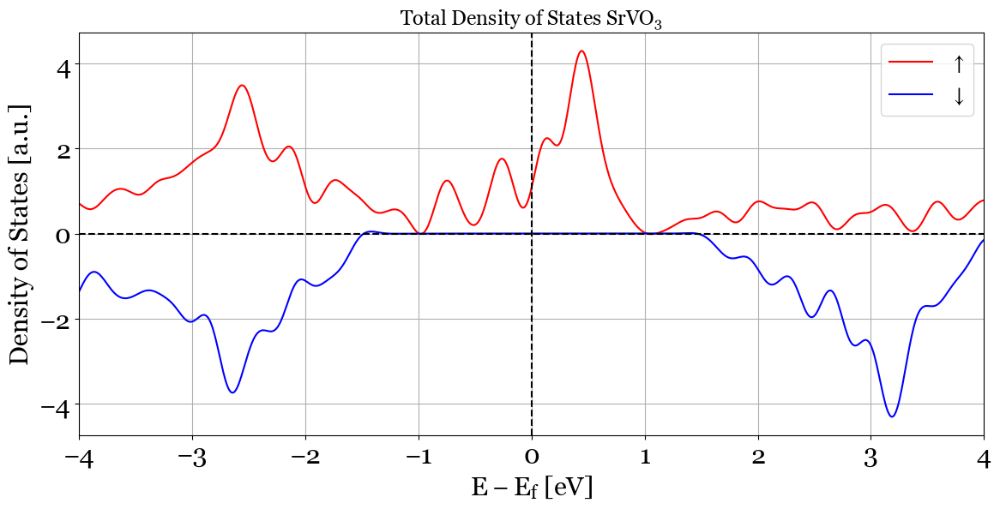
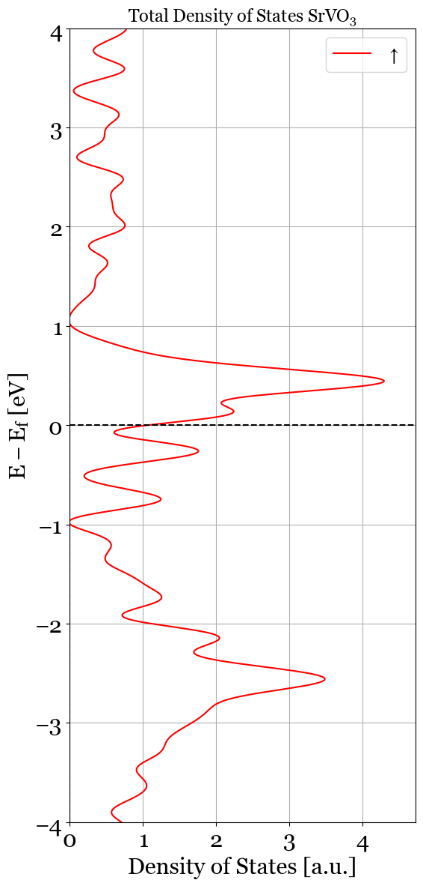
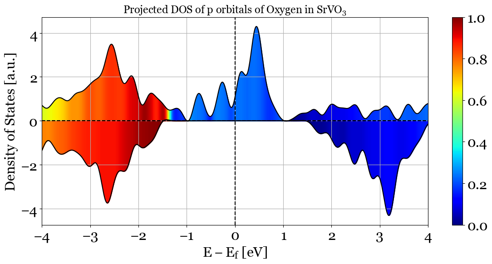
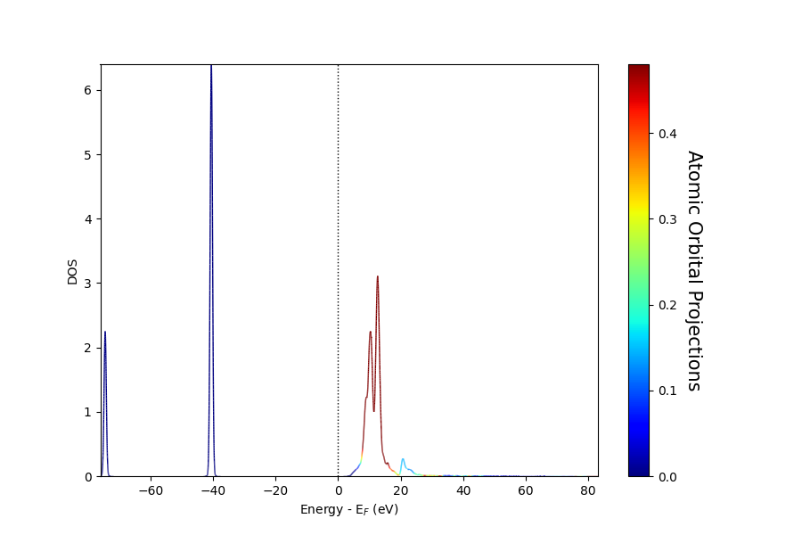
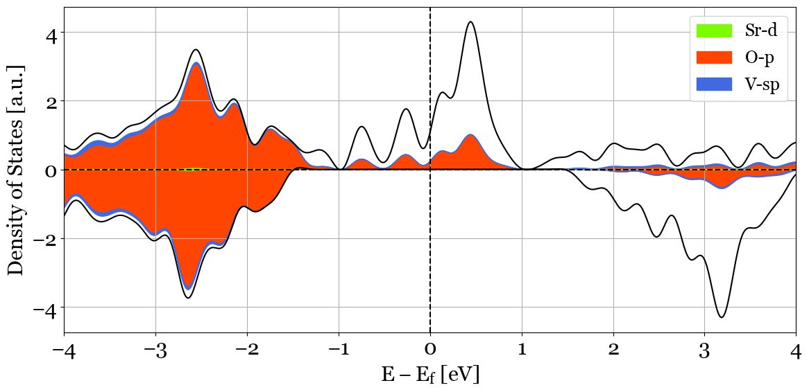
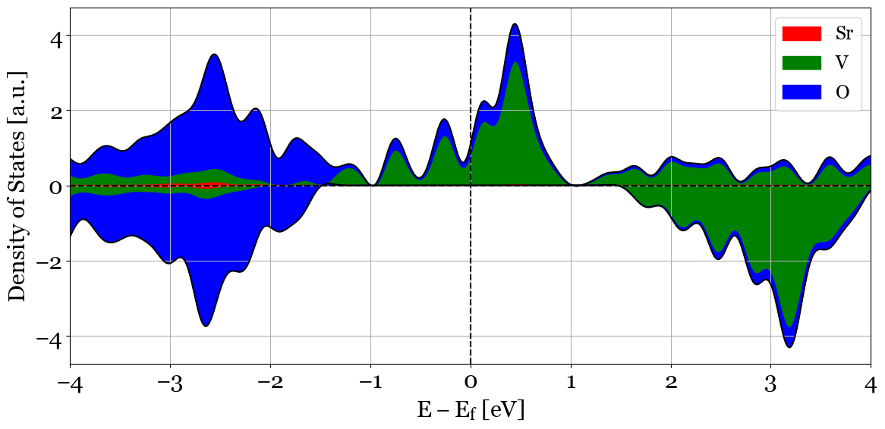
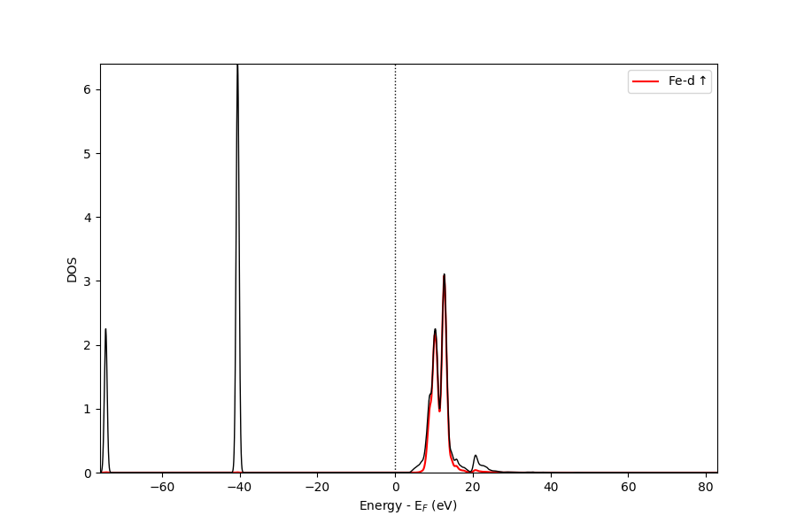
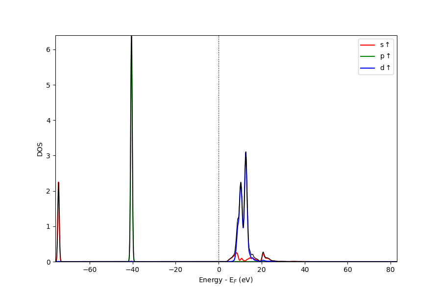

.. _dos:

*****************
Density of States
*****************

Similar to the bands structure plot PyProcar goes beyond the conventional plain Density of states(DOS) plot to plot the projected DOS that carry more information. DOS plots in PyProcar have multiple functionalities(modes), plain, parametric, parametric_line, stack, stack_orbitals and stack_species. To read the information about DOS from the output of DFT calculations pyprocars depends on different files depending on the DFT package. In VASP PyProcar uses vasprun.xml while in elk it uses specific files generated by elk, given the elk.in PyProcar will resolve the files that need to be parsed. The Parameters used in this function are very similar to the ones in bandsplot.

All the arguments invloved in this function are exmplaed in the API of this function that can be found in the following `link <dos.html#pyprocar.scriptDosplot.dosplot>`_ in the end of this document. Each argumnet will have a description, an example and a the dafault setting. If the desired setting matches the default, one does not need to specify that aregumnet. The following section will provide examples of the usage of each mode of plotting. 

.. note:: To copy the example you can easily use the copy button in the right top corner of each example.

1. ``mode='plain'``
===================
	       

This mode plots the basic Total Density of States of the structure. This mode is set as the default mode of ``dosplot()``.

>>>  pyprocar.dosplot(code='vasp',
...                   dirname='vasp_dir',
...                   mode='plain',
...                   elimit=[-4, 4],
...                   orientation='horizontal',
...                   labels=[r'$\uparrow$', r'$\downarrow$'],
...                   title=r'Total Density of States SrVO$_3$')
  

Note that ``filename``, ``mode`` and ``orientation`` did not need to be specifies as we are using the defalut values.
The following will be the change in usage of ``orientation``, and the choice of the spin asked to be plotted. After this example we will switch back to horizontal plot for the examples. and plotting both of the spins in plots.

>>>  pyprocar.dosplot(code='vasp',
...                   dirname='vasp_dir',
...                   mode='plain',
...                   elimit=[-4, 4],
...                   spins=[0],
...                   orientation='vertical',
...                   labels=[r'$\uparrow$', r'$\downarrow$'],
...                   title=r'Total Density of States SrVO$_3$',
...                   savefig='dos_plain_ver.png')

2. ``mode='parametric'``
========================

This mode will use color coding to illustrate the projection of atoms and orbitals asked to be projected. The following will plot shows the projection of p orbitals(``orbitals=[1,2,3]``) of O(``atoms=[2,3,4]``) in SrVO\ :sub:`3`\

>>>  pyprocar.dosplot(code='vasp',
...                   dirname='vasp_dir',
...                   mode='parametric',
...                   orbitals=[1, 2, 3],
...                   atoms=[2, 3, 4],
...                   elimit=[-4, 4],
...                   orientation='horizontal',
...                   plot_total=True,
...                   title=r'Projected DOS of p orbitals of Oxygen in SrVO$_3$')

3. ``mode='parametric_line'``
=============================

This mode will use curves to plot the projected density of states. The following will plot shows the projection of d orbitals(``orbitals=[4,5,6,7,8]``) of Fe(``atoms=[0]``) in Fe.

>>>  pyprocar.dosplot(
...                  code='qe', 
...                  mode='parametric_line',
...                  fermi=5.599480,
...                  atoms=[0],
...                  orbitals=[4,5,6,7,8],
...                  spins=[0],
...                  dirname=data_dir)

4. ``mode='stack'``
===================

This mode plots the contribution of the species and their specified orbitals as stacked curves with filled areas under the curves. The following example represents the stacked projected DOS of d orbitals of Sr(Sr=[4,5,6,7,8]), p orbitals of O(O=[1,2,3]) and the s and p orbitals of V(V=[0,1,2,3]). In this example we have specified colors to have an example for not using the default colors. 

>>>  pyprocar.dosplot(code='vasp',
...                   dirname='vasp_dir',
...                   mode='stack',
...                   colors=['lawngreen', 'orangered', 'royalblue'],
...                   items=dict(Sr=[4, 5, 6, 7, 8], O=[1, 2, 3], V=[0, 1, 2, 3]),
...                   orientation='horizontal',
...                   elimit=[-4, 4],
...                   plot_total=True)

5. ``mode='stack_species'``
===========================

This mode is a more specified version of ``mode=='stack'``. This mode will plot the selected orbitals for all the species. The plot will be stached curves with filled areas under the curve. This mode will plot the selected orbitals for all the species. For example if ``orbitals=[1,2,3]``, PyProcar will plot all the p orbitals of all the species. If no orbital is specifies, it will plot the projection over all the species. The following example is representing the stacked curves for all species, without orbitals defined(i.e. sum over all the orbitals)

>>>  pyprocar.dosplot(code='vasp',
...                   dirname='vasp_dir',
...                   mode='stack_species',
...                   orientation='horizontal',
...                   elimit=[-4, 4],
...                   plot_total=True)

6. ``mode='stack_orbitals'``
============================

This mode is another variation of ``mode=='stack'``, This mode will plot the selected atoms for all the orbitals. The list of atoms do not need to be from the same species. The following example shows all the orbitals of Oxygen(``atoms=[2, 3, 4]``)

>>>  pyprocar.dosplot(code='vasp',
...                   dirname='vasp_dir',
...                   mode='stack_orbitals',
...                   atoms=[2, 3, 4],
...                   orientation='horizontal',
...                   elimit=[-4, 4],
...                   plot_total=True)

7. ``mode='overlay'``
============================

This mode is another variation of ``mode=='overlay'``. This mode will plot the selected atoms and orbitals. The following will plot shows the projection of d orbitals(``orbitals=[4,5,6,7,8]``) of Fe(``atoms=[0]``) in Fe.

>>>  pyprocar.dosplot(
...                  code='qe',
...                  mode='overlay',
...                  fermi=5.599480,
...                  items=items,
...                  dirname=data_dir)

.. image:: ../images/dos_overlay.png

8. ``mode='overlay_species'``
===============================

This mode is another variation of ``mode=='overlay_species'``. This mode will plot the selected orbitals for all the species. The plot will be stached curves with filled areas under the curve. This mode will plot the selected orbitals for all the species. For example if ``orbitals=[4,5,6,7,8]``, PyProcar will plot all the d orbitals of all the species. If no orbital is specifies, it will plot the projection over all the species. The following example is representing the stacked curves for all species, without orbitals defined(i.e. sum over all the orbitals)

>>>  pyprocar.dosplot(
...                  code='qe',
...                  mode='overlay_species',
...                  fermi=5.599480,
...                  orbitals=[4,5,6,7,8],
...                  dirname=data_dir)

9. ``mode='overlay_orbitals'``
===============================

This mode is another variation of ``mode=='overlay_orbitals'``. This mode will plot the selected atoms for all the orbitals. The list of atoms do not need to be from the same species. The following will plot shows all the orbitals for Fe(``atoms=[0]``).

>>>  pyprocar.dosplot(
...                  code='qe',
...                  mode='overlay',
...                  fermi=5.599480,
...                  atoms=[0],
...                  dirname=data_dir)

.. automodule:: pyprocar.scriptDosplot
	:members:
