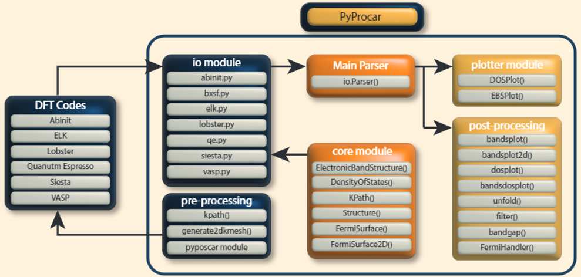

User Guide
**********
In this section, we will provide an overview of the information obtained from DFT codes and the methods used by Pyprocar to access this data. 
For guidance on conducting DFT calculations to generate the necessary files for running PyProcar, please refer to the :ref:`dftprep` section. 
PyProcar is able to process data from various codes, and the format of the information remains consistent across them. 
As an illustration, we have included an example of the atomic projections commonly found in DFT codes, using data from vasp.

The format of the PROCAR is as follows::

	1.   PROCAR lm decomposed 
	2.    of k-points:    4         # of bands: 224         # of ions:  4 
	3. 
	4.    k-point    1 :    0.12500000 0.12500000 0.12500000     weight = 0.12500000 
	5.   
	6.   band   1 # energy  -52.65660295 # occ.  1.00000000 
	7.   
	8.   ion      s     py     pz     px    dxy    dyz    dz2    dxz    dx2    tot 
	9.     1  0.052  0.000  0.000  0.000  0.000  0.000  0.000  0.000  0.000  0.052
	10.    2  0.000  0.000  0.000  0.000  0.000  0.000  0.000  0.000  0.000  0.000 
	11.    3  0.000  0.000  0.000  0.000  0.000  0.000  0.000  0.000  0.000  0.000 
	12.    4  0.000  0.000  0.000  0.000  0.000  0.000  0.000  0.000  0.000  0.000 
	13.    4  0.000  0.000  0.000  0.000  0.000  0.000  0.000  0.000  0.000  0.000 
	14.   tot 0.052  0.000  0.000  0.000  0.000  0.000  0.000  0.000  0.000  0.052 

- Line 1 is a comment 
- Line 2 gives the number of K points calculated (kpoint), number of bands (nband) and number of ions (nion) 
- Line 4 gives the k-point and the weight
- Line 6 gives the energy for kpoints 
- Line 8 Labels of calculated projections, column 11 is the total projection
- Line 9 Calculated projections for atom 1 
- Line 10 Calculated projections for atom 2 and so on 
- Line 14 after projections over all atoms, the total over every atomic projection is reported 

This block is repeated for the other spin channel if the calculation was polarized. 
For spin polarized or non-collinear spin calculations there are additional blocks for each spin component.

The site projected wave function in the PROCAR is calculated by projecting  the  Kohn-Sham  wave  functions  onto  spherical  harmonics  that  are non-zero  within  spheres  of  a  Wigner-Seitz  radius  around  each  ion  by:

.. math::

   |<Y^{\alpha}_{lm}|\phi_{nk}>|^2

where, 
:math:`Y^{\alpha}_{lm}` are the  spherical harmonics centered at ion index :math:`\alpha` with angular moment :math:`l` and magnetic quantum number :math:`m`, and :math:`\phi_{nk}` are the Kohn-Sham wave functions.  In general, for a non-collinear electronic structure calculation the same equation is generalized to:

.. math::

	\frac{1}{2} \sum_{\mu, \nu=1}^{2} \sigma_{\mu, \nu}^{i}<\psi_{n, k}^{\mu}\left|Y_{l m}^{\alpha}><Y_{l m}^{\alpha}\right| \psi_{n, k}^{\nu}>

where :math:`\sigma^i` are the Pauli matrices with :math:`i = x, y , z` and the spinor wavefunction :math:`\phi_{nk}` is now defined as 	 

.. math::
	
	\phi_{nk} & = \begin{bmatrix}
	\psi_{nk}^{\uparrow} \\
	\psi_{nk}^{\downarrow}
	\end{bmatrix}

PyProcar Architecture Overview
==============================

PyProcar is designed with a modular architecture that efficiently processes DFT data from various codes and transforms it into publication-ready visualizations. The library follows a clear data flow from input parsing to output generation.

   
   PyProcar library architecture overview showing the data flow from DFT codes through the IO module to core data objects and finally to plotting functions.

The PyProcar workflow consists of three main components:

**IO Module**: The input/output module serves as the interface between PyProcar and various DFT codes (VASP, Quantum Espresso, ABINIT, ELK, Lobster, and Siesta). This module contains specialized parsers for each DFT code that extract the necessary information from their respective output files and convert it into a standardized format.

**Core Data Objects**: The parsed data is organized into core data structures that provide a unified representation regardless of the originating DFT code. These objects include:

- **ElectronicBandStructure**: Contains band energies, k-points, and electronic structure information
- **DensityOfStates**: Stores density of states data for total and projected calculations  
- **KPath**: Manages k-point paths for band structure calculations
- **Structure**: Holds atomic positions, lattice parameters, and crystallographic information
- **FermiSurface**: Contains Fermi surface data for 2D and 3D visualizations

**Plotting Module**: The visualization layer takes the core data objects and generates publication-quality plots. This module includes specialized plotting functions for band structures, density of states, Fermi surfaces, and other electronic structure properties. The consistent data format from the core objects ensures that all plotting functions work seamlessly regardless of the original DFT code used.

**Scripts Module**: To provide users with a streamlined interface for common plotting tasks, PyProcar includes a collection of high-level scripts that utilize the plotting module. These scripts offer convenient, one-line commands for generating standard electronic structure visualizations:

- **pyprocar.bandsplot()**: Creates band structure plots with optional projections
- **pyprocar.dosplot()**: Generates density of states plots with various styling options  
- **pyprocar.fermi2D()**: Produces 2D Fermi surface cross-sections
- **pyprocar.fermi3D()**: Creates interactive 3D Fermi surface visualizations
- **pyprocar.bandsdosplot()**: Combines band structure and DOS in a single figure
- **pyprocar.unfold()**: Visualizes unfolded band structures for supercells
- **pyprocar.filter()**: Applies filtering to electronic structure data
- **pyprocar.repair()**: Repairs and processes band structure data

These scripts abstract away the complexity of directly interfacing with the core data objects and plotting functions, making PyProcar accessible to users who want quick, publication-ready results without extensive programming. Each script automatically handles data parsing, processing, and visualization with sensible defaults while still allowing for extensive customization through optional parameters.

This modular design allows users to easily switch between different DFT codes while maintaining the same analysis and visualization workflow, making PyProcar a versatile tool for electronic structure analysis.

Further Details
===============
.. toctree::
   :maxdepth: 2

   atomic_projections
   bands
   cat
   comparebands
   dos
   ebs
   fermi2d
   fermi3d
   filter
   kpath
   repair
   structure
   unfold