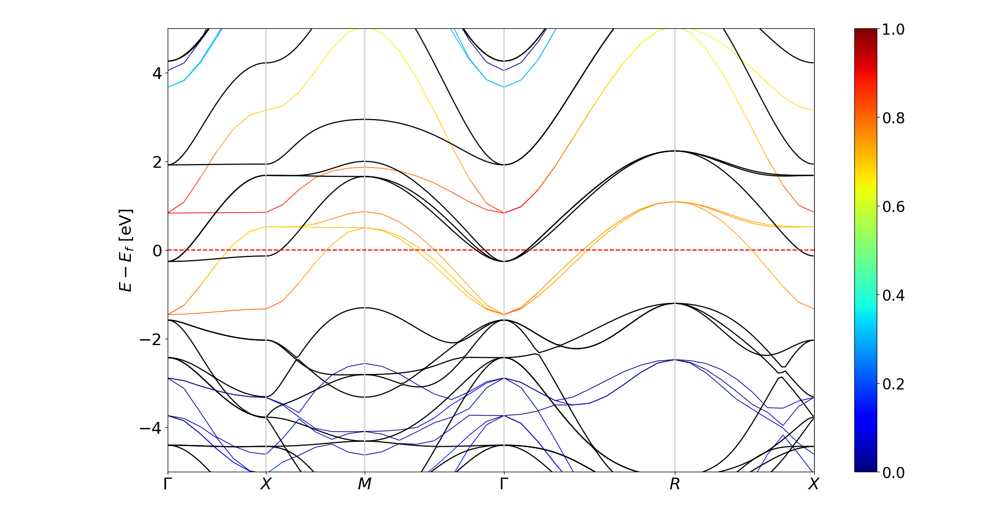

.. _comparebands:

Compare bands
=============

This module is useful to compare bands from different materials on the same band structure plot. The bands are plotted for the same :math:`k`-path in order to have a meaningful comparison but they do not need to have the same number of :math:`k`-points in each interval.
This is acheived by setting ``show=False`` in pyprocar.bandsplot for the first plot so that the figure is not cleared when show() is called. Any number of different modes of plots can be plot on the same figure with this function. The ``savefig`` parameter can be used to save the figure if required. 

Usage::

    ebs_plot = pyprocar.bandsplot(dirname=elk_dir, mode='parametric',elimit=[-5,5],code='elk',orbitals=[4,5,6,7,8], show=False)
    pyprocar.bandsplot(dirname=vasp_dir,mode='plain',elimit=[-5,5],code='vasp',color='k',ax=ebs_plot.ax)

The above command plots the figure displayed below. The black bands are plain bands of :math:`SrVO_3` calculated from VASP and the jet colormap is d orbital projected bands of the same material calculated from Elk.

